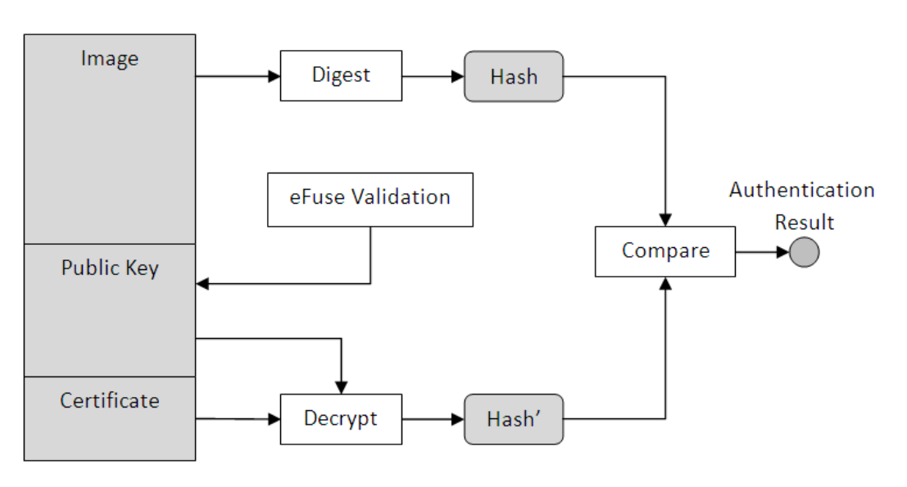

# OS Security

## Secure Boot

Secure boot ensures only authenticated software runs on the device and is achieved by verifying digital signatures of the software prior to executing the code. 
To achieve secure boot SoC support is required. NXP i.MX processors family has support for it, this feature is marketed as High Assurance Boot (HAB).

### Build a chain of Trust

A typical Linux based system has the following components:

* Bootloader

* Kernel, Device Tree

* Root Filesystem + User applications

* Application data

#### Bootloader Authentication

Bootloader Authentication is processor specific. However the mechanisms are the same :

* Creating a public/private key pair
* Signing the bootloader using vendor-specific code signing tools (CST Tool for NXP)
* Burning the public key (or hash of public key) onto One-Time programmable (OTP) fuse on the processor during Production

The processor Boot-ROM code on power-on loads the bootloader with the signature/certificates appended to it,
then authenticates the software by performing the following steps:

* Verify the public key used in the signature/certificate with the one stored in the OTP fuses
* Extract the hash of bootloader from the signature using the verified public key
* Compare the extracted hash with the computed hash of the bootloader. If it matches the boot process is continued if not it stops





##### NXP Signing Tool (CST)

CST Tool can be downloaded from NXP Website at :
https://www.nxp.com/webapp/sps/download/license.jsp?colCode=IMX_CST_TOOL

For imx8mp
https://www.nxp.com/webapp/Download?colCode=IMX_CST_TOOL_NEW

which was ```cst-3.3.1.tgz``` when writting this document.

* Certificates/keys generation:

create a serial number file that OpenSSL wil use for the certificate serial number:

        $ cd cst-2.3.3/keys
        $ echo "12345678" > serial

create a key pass file that contains a passphrase to protect the HAB code signing private keys:

        $ cd cst-2.3.3/keys
        $ echo 'xm5hg86s$ps' >  key_pass.txt
        $ echo 'xm5hg86s$ps' >> key_pass.txt

create the signature keys/certificates for hab4:

        cst-2.3.3/keys$ ./hab4_pki_tree.sh

       ...
       Do you want to use an existing CA key (y/n)?: n
       Do you want to use Elliptic Curve Cryptography (y/n)?: n
       Enter key length in bits for PKI tree: 4096
       Enter PKI tree duration (years): 10
       How many Super Root Keys should be generated? 4
       Do you want the SRK certificates to have the CA flag set? (y/n)?: y

generate the fuse table and binary hash:

        $ cd cst-2.3.3/crts
        $ ../linux64/bin/srktool -h 4 -t SRK_1_2_3_4_table.bin -e SRK_1_2_3_4_fuse.bin -d sha256 -c \
        SRK1_sha256_4096_65537_v3_ca_crt.pem,./SRK2_sha256_4096_65537_v3_ca_crt.pem,./SRK3_sha256_4096_65537_v3_ca_crt.pem,./SRK4_sha256_4096_65537_v3_ca_crt.pem -f 1
        
        
###### IMX.6 based boards

The hashes table that must be burned into the device to validate the public keys, can be generated from the fuse table above using the script:

        #!/bin/bash
        #
        # For iMX6 there are 3 banks available
        #
        bank=3
        word=0
        if [ $# -ne 1 ]; then
                echo Usage: $0  /path/to/SRK_1_2_3_4_fuse.bin
                exit 1
        fi
        for ((i=0; i<8; i++))
        do
                offset=$((i * 4))
                printf "fuse prog -y $bank $word %s\n" `hexdump -s $offset -n 4  -e '/4 "0x"' -e '/4 "%X""\n"' ${1}`
                ((word++))
        done

 a call example :
 
        imx6-hab-cst-sign$ ./imx6-u-boot_fuse_commands.sh /path/to/SRK_1_2_3_4_fuse.bin
        fuse prog -y 3 0 0x85CB70D5
        fuse prog -y 3 1 0xE3064103
        fuse prog -y 3 2 0xF372C459
        fuse prog -y 3 3 0x94C7ECBD
        fuse prog -y 3 4 0x3A98FD08
        fuse prog -y 3 5 0xFBFC10C4
        fuse prog -y 3 6 0x3007BA2B
        fuse prog -y 3 7 0xDED88E4C 
        
###### IMX.8 based boards

get the values for the fuses with

	$ hexdump -e '/4 "0x"' -e '/4 "%X""\n"' < SRK_1_2_3_4_fuse.bin
	0x85CB70D5
	0xE3064103
	0xF372C459
	0x94C7ECBD
	0x3A98FD08
	0xFBFC10C4
	0x3007BA2B
	0xDED88E4C

which leads in the following U-Boot commands:

	=> fuse prog -y 6 0 0x85CB70D5
	=> fuse prog -y 6 1 0xE3064103
	=> fuse prog -y 6 2 0xF372C459
	=> fuse prog -y 6 3 0x94C7ECBD
	=> fuse prog -y 7 0 0x3A98FD08
	=> fuse prog -y 7 1 0xFBFC10C4
	=> fuse prog -y 7 2 0x3007BA2B
	=> fuse prog -y 7 3 0xDED88E4C

Once it's *absolutely* sure about what has been done so far and that it works, you can “close” the device.

This step is IRREVERSIBLE, better make sure there is no HAB Events in open mode configuration!!!!

imx.6 case:

        fuse prog 0 6 0x2

imx.8 case:

	=> fuse prog 1 3 0x02000000

* Signing Process:

The first stage of HAB is the authentication of U-Boot. CST tool is used to generate the CSF data, which includes public
key, certificate, and instruction of authentication process. The CSF data is attached to the original u-boot.img. The process is
called Signature.
The IVT should be modified to contain a pointer to the CSF data. The original u-boot.img image size is around 0x27000 to
0x28000. For convenience, we first extend its size to 0x2F000 (with fill 0x5A). Then concatenate it with the CSF data. The
combined image is again extended to a fixed length (0x31000), which is used as the IVT image size parameter.
The new memory layout is shown in the following image layout:


This process is fully automated in Yocto by using the class uboot-hab-sign.bbclass which is using the default settings:


       # HAB Settings
       HAB_ENABLE= "1"
       HAB_DIR ?= "${HAB_BASE}/conf/hab"
       SRKTAB ?= "${HAB_DIR}/crts/SRK_1_2_3_4_table.bin"
       CSFK ?= "${HAB_DIR}/crts/CSF1_1_sha256_4096_65537_v3_usr_crt.pem"
       SIGN_CERT ?= "${HAB_DIR}/crts/IMG1_1_sha256_4096_65537_v3_usr_crt.pem"

U-Boot is signed then with developement Certificates/keys, For production the local.conf can be used to overwrite those settings by the productive ones.

The outcome of the process is:

| Image  | imx6 | imx8 |
|--------|------|------|
| SPL    | SPL.signed | SPL.signed |
| U-Boot | u-boot-ivt.img-spi.signed | u-boot.itb.signed |

:warning: In imx8 case, you need to build U-Boot with SPL_FIT_GENERATOR disabled. See more infos [i.MX8M HAB](imx8_hab.md)

## Signed Filesystem

To extend the chain of Trust to the Applications, the Root Filesystem must be authenticated on each boot to check it's validity using Digital Signature Verification.
there are several way to achieve this goal such as dm-verity, dm-integrity, IMA/EVM,...But we chose a simple way to implement it by verifying the wohl Rootfs Partition Signature 
in Initramfs before mounting it:


        # +------------+  0x0                     -
        # |            |                          |
        # |            |                          |
        # |            |                          |
        # |            |                          |
        # | File       |                          |
        # | System     |                          |
        # .            |                          |
        # .            |                           > PAYLOAD to be signed      ----+
        # .            |                          |                                |
        # |            |                          |                                |
        # |            |                          |                                |
        # +------------+                          |                                |
        # |            |                          |                                |
        # | Fill Data  |                          |                                |
        # |            |                          |                                |
        # +------------+ MAGIC_OFFSET(MB Aligned) |                                |
        # | Magic      |                          |                                |
        # +------------+ MAGIC_OFFSET + MAGIC_LEN -                                |
        # |            |                                                           |
        # | Signature  | <---------------------------------------------------------+
        # |            |
        # +------------+


1) The rootfs image size is aligned to MB blocks

2) Magic Header is appended to those blocks

3) The sum is then hashed signed and signature is the appended


The class *sign-fs.bbclass*

is automatically performing this process and is using the default settings:


        CA_CERT ?= "${HAB_DIR}/crts/CA1_sha256_4096_65537_v3_ca_crt.pem"
        ROOT_CERT ?= "${HAB_DIR}/crts/SRK1_sha256_4096_65537_v3_ca_crt.pem"
        SIGN_KEY ?= "${HAB_DIR}/keys/IMG1_1_sha256_4096_65537_v3_usr_key.pem"
        PASS_FILE ?= "${HAB_DIR}/keys/key_pass.txt"

added to machine conf or local conf will generate the signed rootfs in deploy folder:

        IMAGE_FSTYPES = "squashfs.signed"

On boot the initramfs is performing the reverse process to verify the digital signature of the rootfs:


        # +------------+  0x0 (MMC_PART_START) ----
        # |            |                          |
        # |            |                          |
        # |            |                          |
        # |            |                          |
        # | File       |                          |
        # | System     |                          |
        # .            |                          |
        # .            |                           > PAYLOAD to be verified    ----+
        # .            |                          |                                |
        # |            |                          |                                |
        # |            |                          |                                |
        # +------------+                          |                                |
        # |            |                          |                                |
        # | Fill Data  |                          |                                |
        # |            |                          |                                |
        # +------------+ MAGIC_OFFSET(MB Aligned) |                                |
        # | Magic      |                          |                                |
        # +------------+ MAGIC_OFFSET + MAGIC_LEN -                                |
        # |            |                                                           |
        # | Signature  | <---------------------------------------------------------+
        # |            |
        # +------------+


### encrypted rootfs (read only squashfs)

As rootfs we use a read-only squashfs (ramdisk). The rootfs is crypted
with dm-crypt with AES-128-GCM.

The class *crypt-fs.bbclass*
performs the needed steps to crypt the FS image.

As it is not a good idea to store the key in plain, we use the
DCP or CAAM for crypting the raw key and get a key blob we can store
in the SPI NOR.

The blob is stored on a project specific device. The user of the layer
should provide a /etc/default/initramfs file, that loads the blob
and copies it into /tmp/key.blob. This is used by the ramdisk to setup
the encryptded rootfs.

To create and store the blob:

	keyctl add symmetric "rootfskey" "<engine> load_plain <key hex text>" @s

For example:

	keyctl add symmetric "rootfskey" "caam load_plain 0102030405060708AABBCCDDEEFF12AA" @s
	keyctl show -x

You get an id for the key.

Then export the blob:

	keyctl pipe <key id> > /tmp/blob

And copy the resulting blob on a persistent device. The real key is never exposed and it is
decrypted with the unique key of the device, so this procedure must be done for each produced
device in the factory.

#### raw key definitions

define for example your raw key for the rootfs image:

ENC_KEY_RAW ?= "fdf6842566d47e47d6874da561fec433"

so the ```crypt-fs``` can use it. This key *never* should be lost!

### DCP usage

see implementation details in *dcp_overview.pdf*

### order of execution

We first crypt the FS image, than sign it, so on boot we first
check the signature and if the signature is OK, we encrypt the
FS image.

See the initrd script: *recipes-core/initrdscripts/files/initramfs-init.sh*

### setup

Intentionally using this meta layer as it is will fail your build.

You must add the keys for HAB boot, signed FS somehow to your yocto build
setup.

This can be done by simply adding another meta layer, which contains all the needed
keys.

Add this meta layer to your build and you use the default keys from there.

Of course, do not use them in your product!

# Example usage of `meta-secure-imx` layer with imx6ull based BSP

## Introduction
This section of the documentation describes the integration of this meta layer
with BSP meta layer.

It is important to also use the `meta-security` and `meta-mainline-common` from
[1] to get the newest stable kernels.

## Available initramfs images:
1. `factory-image-fit` - it is responsible for the factory setup of the iMX
based board:
  - Fuse MAC address from tftp accessible `imx6ull-<board>-mac.txt`
  - Fuse SRK from tftp accessible `SRK_1_2_3_4_fuse.bin`
  - Create rootfs encryption blob - it needs to download (temporarily only)
	the `imx6ull-<board>-rootfs-enc-key.txt` with encryption key (it is the same
	as the one passed to `ENC_KEY_RAW` and will **NOT** be stored on the board)
  - Enable secure booting (a.k.a locking the board) -> PERMANENT
  - Sets the eMMC boot areas as RO (read only) -> PERMANENT.

It needs to be build separately with: `bitbake factory-image-fit`

2. `crypt-image-initramfs` is the fitImage with initramfs (and kernel), which:
  - Will read the keyblob from persistent memory
  - Setup dm-crypt to decrypt the rootfs
  - Switch root to boot from it

It is build when `virtual/kernel` is build (the
`INITRAMFS_IMAGE = "crypt-image-initramfs"` is added to machine.conf file)

## Enhancements to `meta-<board>-bsp` layer

1. `recipes-core/images/factory-image-fit.bbappend` - set correct load address
for the imx6ull SoC

```
do_assemble_fit_prepend() {
	sed -i "s|ITS_KERNEL_LOAD_ADDR|0x87800000|g" ${B}/rescue.its.in
	sed -i "s|ITS_KERNEL_ENTRY_ADDR|0x87800000|g" ${B}/rescue.its.in
}
```

2. `recipes-core/initrdscripts/initramfs-init_%.bbappend`
```
FILESEXTRAPATHS_prepend := "${THISDIR}/files:"

SRC_URI += " \
  file://initramfs \
"

INITFUNCTIONS_INSTALL_DIR ?= "${sysconfdir}/default"

do_install_append () {
	install -d ${D}${sysconfdir}
	install -d ${D}${INITFUNCTIONS_INSTALL_DIR}
	install -m 0755 ${WORKDIR}/initramfs ${D}${INITFUNCTIONS_INSTALL_DIR}
}

FILES_${PN} += " \
  ${INITFUNCTIONS_INSTALL_DIR}/initramfs \
"
```

3. `recipes-core/initrdscripts/files/initramfs`  - set board specific bash
functions and variables

```
# Board specific defines
#
imx_soc="imx6ull"
keystoredev="mmc"
keystoremmcdev="1"
keystoremmcpart="boot0"
board="<board>"

# dcp blob has 138 bytes
keysize="138"

# eMMC boot0 part offset (in LBAs)
# Provide 512B to store the blob
# 4MiB - 512B (and converted to LBA)
keyoffset="8191"

keyblobpath="/tmp/dmcrypt.blob"

# We use rootfs encryption with signed key
VERIFYROOTFS="no"

CRYPT_KEY_FILE="imx6ull-<board>-rootfs-enc-key.txt"
MAC_ADDR_FILE="imx6ull-<board>-mac.txt"

# Fuse nvmem offsets for imx6ull
IMX_FUSE_SEC_CONFIG_IDX="6"
IMX_FUSE_SEC_CONFIG_VAL="\x2\x0\x0\x0"

IMX_FUSE_SRK_IDX="24"
IMX_FUSE_SRK_SIZE="8"

IMX_FUSE_MAC0_IDX="34"
IMX_FUSE_MAC1_IDX="35"

# From u-boot envs
get_root_dev_path () {
	mmc_part=$(fw_printenv -n mmcdev)
	root_part=$(fw_printenv -n rootpart)

	ROOT_DEV="/dev/mmcblk${mmc_part}p${root_part}"
}

load_key_blob () {
	tfile="/tmp/keytmp"
	dd if=/dev/mmcblk${keystoremmcdev}${keystoremmcpart} of=${tfile} bs=512 skip=${keyoffset} count=1 2>/dev/null
	dd if=${tfile} of=${keyblobpath} bs=1 count=${keysize} 2>/dev/null

	rm ${tfile}
}

imx_fuse_read () {
	idx=${1}
	count=${2}

	[ -z ${idx} ] && return 1
	[ -z ${count} ] && return 1

	ocotp_patch=$(find /sys/bus/ -name "imx-ocotp0")
	[ -z ${ocotp_patch} ] && { echo "No FUSE support!"; return 1; }
	ocotp_file=${ocotp_patch}/nvmem

	dd if=${ocotp_file} bs=4 count=${count} skip=${idx} 2>/dev/null | hexdump -e '"0x%04x\n"'
}

imx_fuse_write () {
	idx=${1}
	file=${2}

	[ -z ${idx} ] && return 1
	[ -z ${file} ] && return 1

	ocotp_patch=$(find /sys/bus/ -name "imx-ocotp0")
	[ -z ${ocotp_patch} ] && { echo "No FUSE support!"; return 1; }
	ocotp_file=${ocotp_patch}/nvmem

	# Below is a test code to check if we are going to correctly write fuses
	#hexdump ${ocotp_file}
	#dd if=/dev/zero of=/tmp/foo bs=64 count=1 2>/dev/null
	#dd if=${file} of=/tmp/foo bs=4 seek=${idx} 2>/dev/null
	#hexdump /tmp/foo

	# Real code to program fuses
	dd if=${file} of=${ocotp_file} bs=4 seek=${idx} 2>/dev/null
}

# imx6ull FUSE information
# static const char *imx6ull_otp_desc[][8] = {
# BANK8(LOCK, CFG0, CFG1, CFG2, CFG3, CFG4, CFG5, CFG6),
# BANK8(MEM0, MEM1, MEM2, MEM3, MEM4, ANA0, ANA1, ANA2),
# BANK8(OTPMK0, OTPMK1, OTPMK2, OTPMK3, OTPMK4, OTPMK5, OTPMK6, OTPMK7),
# BANK8(SRK0, SRK1, SRK2, SRK3, SRK4, SRK5, SRK6, SRK7),
# BANK8(SJC_RESP0, SJC_RESP1, MAC0, MAC1, MAC2, CRC, GP1, GP2),
# BANK8(SW_GP0, SW_GP1, SW_GP2, SW_GP3, SW_GP4,  MISC_CONF,  FIELD_RETURN, SRK_REVOKE),
# BANK8(ROM_PATCH0, ROM_PATCH1, ROM_PATCH2, ROM_PATCH3, ROM_PATCH4, ROM_PATCH5, ROM_PATCH6, ROM_PATCH7),
# BANK8(GP30, GP31, GP32, GP33, GP40, GP41, GP42, GP43),
#};

factory_get_file () {
	file="${1}"
	[ -z ${file} ] && { echo "File to get not provided!"; return 1; }

	tftp -g -r ${file} -l /tmp/${file} 192.168.0.1
}

set_ro_on_mmcboot() {
     dev="${1}"
     bootpart="${2}"
     mmcboot="mmcblk${dev}boot${bootpart}"

     [ -b /dev/${mmcboot} ] || { echo "No ${mmcboot}!"; return 1; }

     echo "Setting ${mmcboot} to RO !"
     # Please use the -p switch to set RO for boot area permanently,
     # otherwise the RO is only till next boot.
     mmc writeprotect boot set /dev/mmcblk${dev} ${bootpart}
}

# Board specific quirks:
#
board_factory_setup () {
	echo "Set booting from /dev/mmcblk1boot0"
	mmc bootpart enable 1 0 /dev/mmcblk1

	set_ro_on_mmcboot 1 0 || { echo "FAIL!"; return 1; }
	set_ro_on_mmcboot 1 1 || { echo "FAIL!"; return 1; }
}

```

The `iMX7/8` will have different offsets for eFUSE registers, but
the overall idea for read/write functions can be reused.


Links:
------

[1] - https://source.denx.de/denx/meta-mainline-common

